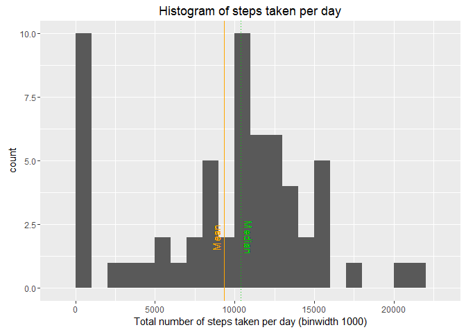
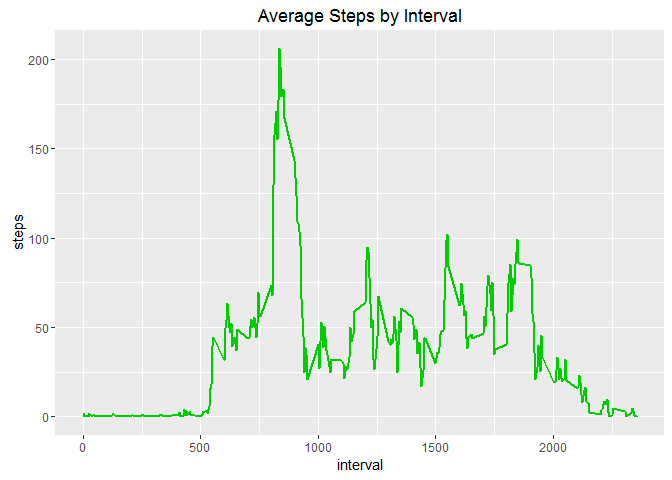
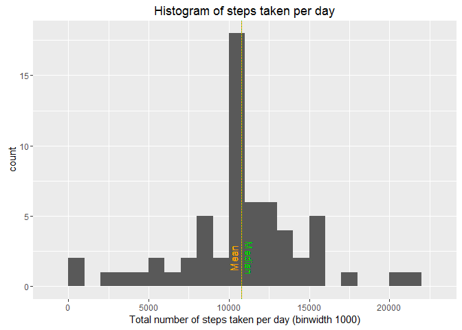
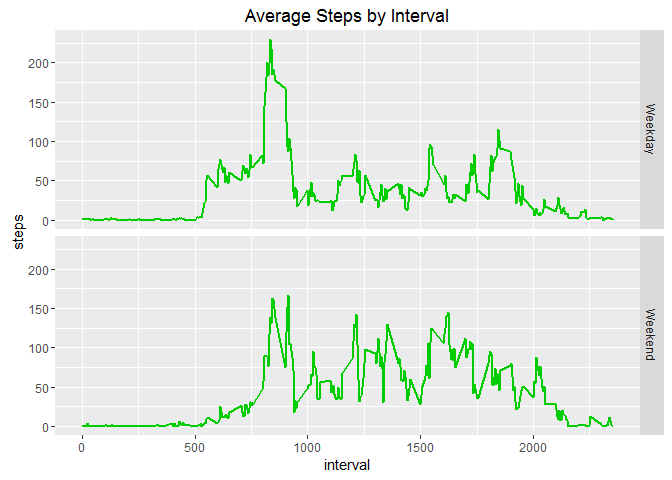

# Reproducible Research: Peer Assessment 1


## Loading and preprocessing the data

```r
# original file URL
downloadUrl <- "https://d396qusza40orc.cloudfront.net/repdata%2Fdata%2Factivity.zip"

# check file
if (!file.exists("activity.csv")) {
        download.file(downloadUrl, destfile = "data.zip")
        unzip("data.zip")
        file.remove("data.zip")
}

#load file
data <- read.csv("activity.csv")

#transform date variable as Date in order to use the weekdays() function
data$date <- as.Date(data$date)
```


## What is mean total number of steps taken per day?

```r
#histogram of steps taken per day, ignoring the missing values in the dataset
library(ggplot2)
totalStepsPerDay <- aggregate(x = data$steps , by = list(data$date), FUN = sum ,na.rm=TRUE)
names(totalStepsPerDay) <- c("date","steps")
histPlot <- ggplot(totalStepsPerDay,aes(x = steps)) +
        ggtitle("Histogram of steps taken per day") +
        xlab("Total number of steps taken per day (binwidth 1000)") +
        geom_histogram(binwidth = 1000) + 
        geom_vline(aes(xintercept=mean(steps)),color="orange") +
        geom_text(aes(x=mean(steps),y=2),color="orange", label="Mean",vjust=-0.5,angle=90, size=4) +
        geom_vline(aes(xintercept=median(steps)), linetype="dotted", color="green3") +
        geom_text(aes(x=median(steps),y=2),color="green3", label="Median",vjust=-0.5,angle=-90, size=4)
histPlot
```



```r
#mean of steps taken per day, ignoring the missing values in the dataset
mean(totalStepsPerDay$steps , na.rm = TRUE)
```

```
## [1] 9354.23
```

```r
#median of steps taken per day, ignoring the missing values in the dataset
median(totalStepsPerDay$steps , na.rm = TRUE)
```

```
## [1] 10395
```

## What is the average daily activity pattern?

```r
#time series plot of the 5-minute interval and the average number of steps taken, averaged across all days
averageStepsByInterval  <- aggregate(x = data$steps , by = list(data$interval), FUN = mean ,na.rm=TRUE)
names(averageStepsByInterval) <- c("interval","steps")

linePlot <- ggplot(averageStepsByInterval,aes(interval,steps)) +
                 ggtitle("Average Steps by Interval") +
                 geom_line(col="green3", size=1)
linePlot
```



```r
#time interval that contains the maximum number of steps
averageStepsByInterval[which.max(averageStepsByInterval$steps),c("interval")]
```

```
## [1] 835
```


## Imputing missing values

```r
#total number of missing values in the dataset
missing <- nrow(data[is.na(data$steps),])
missing
```

```
## [1] 2304
```

```r
#fill missing steps values with the mean for 5-minute interval and create a new dataset equal to the original one but with the missing data filled in
tinyData <- merge(x = data, y = averageStepsByInterval, by = "interval", all.x = TRUE)
tinyData[is.na(tinyData$steps.x),c("steps.x")] <- tinyData[is.na(tinyData$steps.x),c("steps.y")]
tinyData$date <- as.Date(tinyData$date)
tinyData$date.x <- NULL
tinyData$Group.1 <- NULL
tinyData$steps <- tinyData$steps.x
tinyData$steps.x <- NULL
tinyData$steps.y <- NULL

#histogram of the new dataset
totalStepsPerDay <- aggregate(x = tinyData$steps , by = list(tinyData$date), FUN = sum ,na.rm=TRUE)
names(totalStepsPerDay) <- c("date","steps")
histPlot <- ggplot(totalStepsPerDay,aes(x = steps)) +
        ggtitle("Histogram of steps taken per day") +
        xlab("Total number of steps taken per day (binwidth 1000)") +
        geom_histogram(binwidth = 1000) + 
        geom_vline(aes(xintercept=mean(steps)),color="orange") +
        geom_text(aes(x=mean(steps),y=2),color="orange", label="Mean",vjust=-0.5,angle=90, size=4) +
        geom_vline(aes(xintercept=median(steps)), linetype="dotted", color="green3") +
        geom_text(aes(x=median(steps),y=2),color="green3", label="Median",vjust=-0.5,angle=-90, size=4)
histPlot
```



```r
#mean of steps taken per day, using the new dataset
mean(totalStepsPerDay$steps)
```

```
## [1] 10766.19
```

```r
#median of steps taken per day, using the new dataset
median(totalStepsPerDay$steps)
```

```
## [1] 10766.19
```


## Are there differences in activity patterns between weekdays and weekends?

```r
#set local time to detect weekdays names, as I live outside US
Sys.setlocale("LC_TIME", "English");
```

```
## [1] "English_United States.1252"
```

```r
#detect day type (weekday or weekend)
for (i in 1:nrow(tinyData)) {
    dayType <- weekdays(tinyData$date[i])
    if ( dayType %in% c("Monday", "Tuesday", "Wednesday", "Thursday", "Friday")) {
        tinyData$dayType[i] <- c("Weekday")
    } else {
        tinyData$dayType[i] <- c("Weekend")
    }
}

averages <- aggregate(steps ~ interval + dayType, data = tinyData, mean)

linePlot <- ggplot(averages, aes(interval, steps)) + 
        ggtitle("Average Steps by Interval") +
        geom_line(col="green3", size=1) + 
        facet_grid(dayType ~ .) + 
        xlab("interval") + 
        ylab("steps")

linePlot
```


